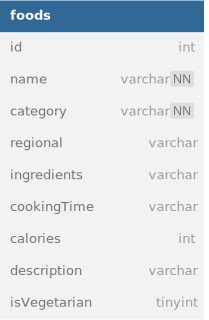

# Nusantara Food

Nusantara Food API for listing various food in Indonesia

## REST API Specification

- Production: https://nusantara-food.anandamarwan.com
- Local: http://localhost:3000

| Endpoint     | HTTP     | Description           | Implemented |
| ------------ | -------- | --------------------- | ----------- |
| `/foods`     | `GET`    | Get all foods         | ✅          |
| `/foods/:id` | `GET`    | Get one food by id    | ✅          |
| `/foods`     | `POST`   | Add new food          | ✅          |
| `/foods`     | `DELETE` | Delete all foods      | ✅          |
| `/foods/:id` | `DELETE` | Delete one food by id | ✅          |
| `/foods/:id` | `PUT`    | Update one food by id | ✅          |

## ERD



## Getting Started

To install dependencies:

```sh
bun install
```

To run:

```sh
bun run dev
```

open http://localhost:3000
